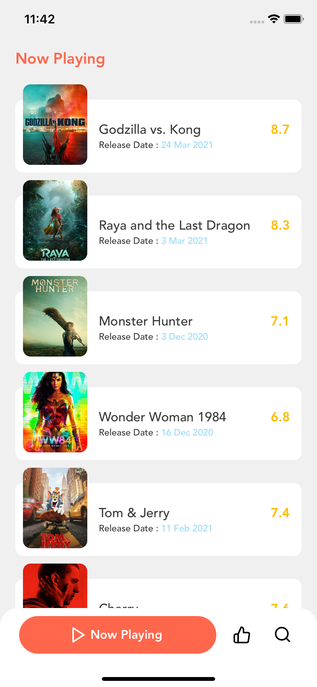

# Cima+ 
iOS Client App for TMDB 

#### Using:
 - [x] MVVM
 - [x] Clean Architecture
 - [x] Coordinator pattern / [XCoordinator](https://github.com/quickbirdstudios/XCoordinator)
 - [x] [RxSwift](https://github.com/ReactiveX/RxSwift), [RxCocoa](https://github.com/ReactiveX/RxSwift/tree/master/RxCocoa), [RxMoya](https://github.com/Moya/Moya)
 
 #### API:
  - [x] [TMDB](https://developers.themoviedb.org/3)
  
 #### Screenshots:
   
 
    
